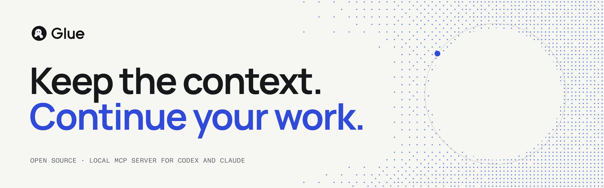

<picture>
  <source media="(prefers-color-scheme: dark)" srcset="docs/assets/readme-banner-dark.png">
  
</picture>

# Glue

Glue lets your AI assistant save a piece of work and pick it up later, in a new conversation or a different app. Each save is a readable Markdown handoff in your project, plus exact copies of the files it relied on. When you resume, Glue tells you which of those files have changed since.

Glue is a local [Model Context Protocol](https://modelcontextprotocol.io) (MCP) server for Codex, Claude Code and Claude Desktop. It runs on your machine, saves only into the project you connect it to, and makes no network requests.

## Why Glue

Conversations end and context windows fill up. What usually survives is a summary with nothing behind it. With Glue:

- **You can read the handoff.** It is a Markdown file such as `notes/handoff.md`. Edit or review it like any other file.
- **Nothing is overwritten.** Every save is a new revision. Earlier decisions and corrections stay readable.
- **Claims come with evidence.** Glue keeps exact copies of the files you select. On resume, it reports which ones changed.
- **Linked work is checked too.** A handoff can depend on another saved handoff. Resume reports when that one has moved on.
- **You decide what is saved.** Glue does not record conversations or scan your files.

## Quickstart

You need [Node.js](https://nodejs.org) 22 or later.

1. Download Glue and install its dependencies:

   ```sh
   git clone https://github.com/intwerpret/glue.git
   cd glue
   npm ci
   ```

2. Go to your project and run the installer. It asks whether you use Codex or Claude Code.

   ```sh
   cd path/to/your-project
   node path/to/glue/install.mjs
   ```

3. Open the project in your assistant, approve the `glue` server if asked, and start a new session.

For the Claude Code plugin, Claude Desktop, checking the install and uninstalling, see the [quickstart guide](docs/quickstart.md).

## Example

Ask in plain language. Glue runs only when you ask for it.

> Use Glue to save where we are to `notes/handoff.md`. Include our decisions, the open questions and `src/parser.ts` as evidence.

The assistant writes the handoff and saves it. Days later, in a fresh conversation:

> Use Glue to find the parser work and resume it. Tell me what changed.

The assistant finds the handoff and resumes it. Glue reports that `src/parser.ts` has changed since the save. The assistant can read the saved copy of that file and compare it with the current one before relying on the old conclusions.

More examples are in [Ways to use Glue](docs/ways-to-use-glue.md).

## Documentation

- [Quickstart](docs/quickstart.md): install, check, first save, uninstall
- [How Glue works](docs/how-it-works.md): terms, the save and resume cycle, where data lives
- [Ways to use Glue](docs/ways-to-use-glue.md): worked examples with prompts
- [Tools reference](docs/tools.md): the six tools, their parameters and errors
- [Limits](docs/limits.md): every numeric limit, and what Glue does not do
- [Privacy](docs/privacy.md): what is stored, who can see it, cleaning up
- [Recovery](docs/recovery.md): repairing damaged history and removing an accidental save
- [Troubleshooting](docs/troubleshooting.md) and [FAQ](docs/faq.md)
- [Release notes](RELEASE-NOTES.md)

## Update or remove

There is no automatic updater. To update, remove the installed copy and install the new version. To remove Glue, delete its installed files and its entry in your host's configuration. Your handoffs and the `.glue` folder stay in place either way. See [Update and uninstall](docs/quickstart.md#update-and-uninstall) for each host.

## Contributing

Issues and pull requests are welcome. Read [CONTRIBUTING.md](CONTRIBUTING.md) first. Commits must be signed off under the Developer Certificate of Origin. Everyone taking part follows the [Code of Conduct](CODE_OF_CONDUCT.md).

To report a vulnerability, follow the [security policy](SECURITY.md). Do not open a public issue.

## License

Glue is licensed under [Apache-2.0](LICENSE). Third-party components are listed in [THIRD-PARTY-NOTICES.md](THIRD-PARTY-NOTICES.md). The Glue name and logos are covered by the [trademark policy](TRADEMARKS.md).
